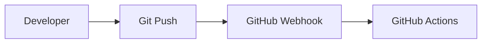
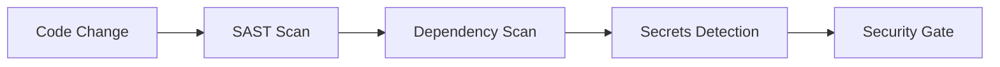
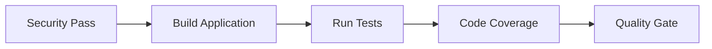
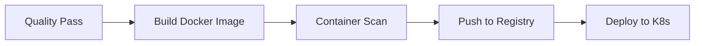
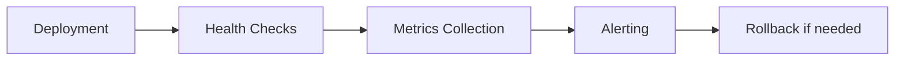

# DevOps/DevSecOps CI/CD Pipeline Project

A comprehensive, industry-grade CI/CD pipeline built with free and open-source tools, demonstrating real-world DevOps/DevSecOps practices.

## 🏗️ Architecture Overview

```
┌─────────────────┐    ┌─────────────────┐    ┌─────────────────┐
│   Source Code   │    │   CI/CD Tools   │    │   Security      │
│   Management    │    │                 │    │   Scanning      │
│                 │    │                 │    │                 │
│ • GitHub       │───▶│ • GitHub Actions│───▶│ • SonarQube     │
│ • Git Flow     │    │ • Jenkins       │    │ • Trivy         │
│                 │    │                 │    │ • Gitleaks     │
└─────────────────┘    └─────────────────┘    └─────────────────┘
                                │
                                ▼
┌─────────────────┐    ┌─────────────────┐    ┌─────────────────┐
│   Build & Test  │    │ Containerization│    │ Infrastructure  │
│                 │    │                 │    │ as Code        │
│ • Maven/Gradle │◀───│ • Docker        │◀───│ • Terraform    │
│ • npm          │    │ • Multi-stage   │    │ • Ansible      │
│ • Unit Tests   │    │ • Security      │    │ • Kubernetes   │
└─────────────────┘    └─────────────────┘    └─────────────────┘
                                │
                                ▼
┌─────────────────┐    ┌─────────────────┐    ┌─────────────────┐
│   Artifact      │    │   Deployment    │    │   Monitoring   │
│   Storage       │    │                 │    │   & Logging    │
│                 │    │                 │    │                 │
│ • Nexus OSS    │    │ • Kubernetes    │    │ • Prometheus   │
│ • GitHub Pkgs  │    │ • Minikube      │    │ • Grafana      │
│ • Helm Charts  │    │ • ArgoCD        │    │ • Loki         │
└─────────────────┘    └─────────────────┘    └─────────────────┘
```

## 🛠️ Technology Stack

### Core CI/CD
- **Source Control**: GitHub (Free)
- **CI/CD Orchestration**: GitHub Actions (Free) + Jenkins (Open Source)
- **Build Tools**: Maven (Java) + npm (Node.js)
- **Containerization**: Docker Desktop (Free)

### Security (DevSecOps)
- **SAST**: SonarQube Community Edition
- **Dependency Scanning**: OWASP Dependency-Check + Trivy
- **Container Scanning**: Trivy
- **Secrets Detection**: Gitleaks
- **Vulnerability Management**: OWASP ZAP (DAST)

### Infrastructure & Deployment
- **IaC**: Terraform (Free) + Ansible (Open Source)
- **Container Orchestration**: Kubernetes (Minikube/Kind)
- **Artifact Management**: Nexus OSS + GitHub Packages
- **Service Mesh**: Istio (Open Source)

### Monitoring & Observability
- **Metrics**: Prometheus + Grafana
- **Logging**: Loki + Promtail
- **Tracing**: Jaeger
- **Alerting**: AlertManager

### Cloud & Local Options
- **Cloud**: AWS Free Tier / GCP Free Tier / Azure Free
- **Local**: Docker Desktop + Minikube + LocalStack

## 🚀 Quick Start

### Prerequisites
```bash
# Required software
- Docker Desktop
- Git
- Node.js 18+
- Java 17+
- kubectl
- terraform
- ansible

# Optional (for local development)
- minikube
- kind
- localstack
```

### 1. Clone and Setup
```bash
git clone <your-repo>
cd devops-cicd-pipeline
./scripts/setup.sh
```

### 2. Start Local Infrastructure
```bash
# Start Kubernetes cluster
./scripts/start-k8s.sh

# Start monitoring stack
./scripts/start-monitoring.sh

# Start security tools
./scripts/start-security.sh
```

### 3. Deploy Sample Application
```bash
# Deploy via CI/CD pipeline
git push origin main

# Or deploy manually
./scripts/deploy-app.sh
```

### 4. Access Dashboards
- **Grafana**: http://localhost:3000 (admin/admin)
- **SonarQube**: http://localhost:9000 (admin/admin)
- **Jenkins**: http://localhost:8080
- **Kubernetes Dashboard**: http://localhost:8001

## 📁 Project Structure

```
devops-cicd-pipeline/
├── src/                          # Application source code
│   ├── app/                     # Main application
│   └── api/                     # API services
├── ci-cd/                       # CI/CD configurations
│   ├── github-actions/          # GitHub Actions workflows
│   └── jenkins/                 # Jenkins pipelines
├── infrastructure/               # Infrastructure as Code
│   ├── terraform/               # Terraform configurations
│   └── ansible/                 # Ansible playbooks
├── security/                     # Security scanning tools
│   ├── sast/                    # Static Application Security Testing
│   ├── dast/                    # Dynamic Application Security Testing
│   ├── container/               # Container security
│   └── secrets/                 # Secrets detection
├── monitoring/                   # Monitoring and logging
│   ├── prometheus/              # Metrics collection
│   ├── grafana/                 # Visualization dashboards
│   └── loki/                    # Log aggregation
├── docs/                        # Documentation
├── scripts/                     # Automation scripts
└── README.md                    # This file
```

## 🔒 Security Features

### SAST (Static Application Security Testing)
- SonarQube integration for code quality and security
- Automated vulnerability detection in source code
- Code coverage and quality gates

### Dependency Scanning
- OWASP Dependency-Check for known vulnerabilities
- Trivy for comprehensive dependency analysis
- Automated license compliance checking

### Container Security
- Trivy container scanning
- Base image vulnerability assessment
- Multi-stage build optimization

### Secrets Detection
- Gitleaks integration
- Pre-commit hooks for secrets prevention
- Automated scanning in CI/CD pipeline

## 📊 Monitoring & Observability

### Metrics Collection
- Prometheus for time-series metrics
- Custom application metrics
- Infrastructure and container metrics

### Visualization
- Grafana dashboards for:
  - CI/CD pipeline metrics
  - Application performance
  - Infrastructure health
  - Security scan results

### Logging
- Centralized logging with Loki
- Structured logging format
- Log retention policies

### Alerting
- Prometheus AlertManager
- Slack/Discord notifications
- Escalation policies

## 🚀 CI/CD Pipeline Flow

### 1. Code Commit


### 2. Security Scanning


### 3. Build & Test


### 4. Container & Deploy


### 5. Monitoring


## 🎯 Use Cases

### For Developers
- Automated testing and quality gates
- Security scanning in development workflow
- Easy deployment to multiple environments

### For DevOps Engineers
- Infrastructure as Code practices
- Automated deployment pipelines
- Monitoring and alerting setup

### For Security Teams
- Integrated security scanning
- Vulnerability management
- Compliance reporting

### For Operations
- Centralized monitoring
- Automated scaling
- Incident response automation

## 🔧 Configuration

### Environment Variables
```bash
# Required environment variables
export GITHUB_TOKEN=your_github_token
export DOCKER_REGISTRY=your_registry
export KUBECONFIG=~/.kube/config
export AWS_ACCESS_KEY_ID=your_aws_key
export AWS_SECRET_ACCESS_KEY=your_aws_secret
```

### Customization
- Modify `ci-cd/github-actions/` for different CI/CD flows
- Update `infrastructure/terraform/` for cloud-specific resources
- Customize `monitoring/grafana/` dashboards for your metrics

## 📚 Learning Resources

- [GitHub Actions Documentation](https://docs.github.com/en/actions)
- [Jenkins Pipeline Syntax](https://www.jenkins.io/doc/book/pipeline/)
- [Terraform Best Practices](https://www.terraform.io/docs/cloud/guides/recommended-practices/)
- [Kubernetes Documentation](https://kubernetes.io/docs/)
- [DevSecOps Practices](https://owasp.org/www-project-devsecops-maturity-model/)

## 🤝 Contributing

1. Fork the repository
2. Create a feature branch
3. Make your changes
4. Add tests and documentation
5. Submit a pull request

## 📄 License

This project is licensed under the MIT License - see the [LICENSE](LICENSE) file for details.

## 🙏 Acknowledgments

- Open source community for amazing tools
- Cloud providers for free tier offerings
- Security researchers for vulnerability databases

---

**Note**: This project is designed for learning and portfolio purposes. For production use, please ensure proper security configurations and compliance with your organization's policies.
