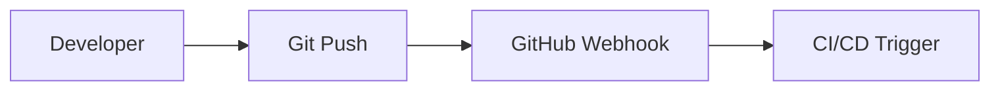
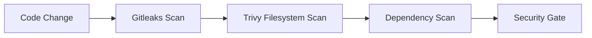
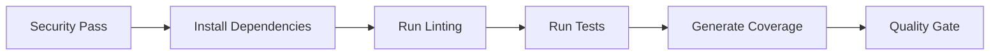
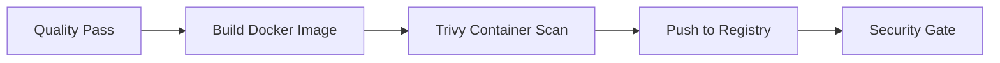
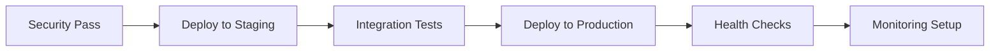

# DevOps CI/CD Pipeline Architecture Documentation

## Table of Contents

1. [Overview](#overview)
2. [Architecture Components](#architecture-components)
3. [Pipeline Flow](#pipeline-flow)
4. [Security Implementation](#security-implementation)
5. [Monitoring & Observability](#monitoring--observability)
6. [Infrastructure as Code](#infrastructure-as-code)
7. [Deployment Strategies](#deployment-strategies)
8. [Configuration Management](#configuration-management)
9. [Testing Strategy](#testing-strategy)
10. [Security Scanning](#security-scanning)
11. [Performance & Scalability](#performance--scalability)
12. [Disaster Recovery](#disaster-recovery)
13. [Cost Optimization](#cost-optimization)
14. [Implementation Guide](#implementation-guide)
15. [Troubleshooting](#troubleshooting)

## Overview

The DevOps CI/CD Pipeline is a comprehensive, industry-grade solution that demonstrates real-world DevOps and DevSecOps practices. It integrates security scanning, automated testing, containerization, infrastructure as code, and monitoring into a seamless deployment pipeline.

### Key Features

- **Multi-environment deployment** (dev, staging, production)
- **Security-first approach** with integrated scanning
- **Infrastructure as Code** using Terraform and Ansible
- **Comprehensive monitoring** with Prometheus, Grafana, and Loki
- **Automated testing** and quality gates
- **Container security** scanning
- **Secrets detection** and management
- **Cost optimization** and resource management

## Architecture Components

### 1. Source Code Management

```
GitHub Repository
├── Main Branch (Production)
├── Develop Branch (Staging)
└── Feature Branches (Development)
```

**Features:**
- Git flow branching strategy
- Protected branches with required reviews
- Automated security scanning on commits
- Pre-commit hooks for code quality

### 2. CI/CD Orchestration

#### GitHub Actions
- **Workflow**: `.github/workflows/main.yml`
- **Triggers**: Push to main/develop, pull requests, releases
- **Jobs**: Security scan, code quality, testing, build, deploy

#### Jenkins
- **Pipeline**: `ci-cd/jenkins/Jenkinsfile`
- **Stages**: Checkout, security scan, code quality, testing, build, deploy
- **Integration**: Kubernetes, Docker, security tools

### 3. Application Layer

#### Node.js Microservice
- **Framework**: Express.js with security middleware
- **Features**: Health checks, metrics endpoint, structured logging
- **Security**: Helmet, CORS, rate limiting, input validation

#### Containerization
- **Dockerfile**: Multi-stage build with security best practices
- **Base Image**: Alpine Linux for minimal attack surface
- **Security**: Non-root user, minimal dependencies, health checks

### 4. Infrastructure Layer

#### Kubernetes
- **Cluster**: EKS (AWS) or Minikube (local)
- **Deployment**: Rolling updates with health checks
- **Scaling**: Horizontal Pod Autoscaler
- **Security**: Network policies, RBAC, pod security policies

#### Cloud Infrastructure (AWS)
- **VPC**: Private/public subnets with NAT gateways
- **EKS**: Managed Kubernetes cluster
- **RDS**: PostgreSQL database
- **ElastiCache**: Redis for caching
- **ALB**: Application load balancer
- **S3**: Artifact storage and logs

## Pipeline Flow

### 1. Code Commit & Push



### 2. Security Scanning



**Security Gates:**
- No secrets in codebase
- No critical/high vulnerabilities
- Dependencies are up-to-date
- Code quality meets standards

### 3. Build & Test



**Quality Gates:**
- Test coverage > 80%
- No linting errors
- All tests pass
- SonarQube quality gate passes

### 4. Container Build & Security



**Container Security:**
- Base image vulnerability assessment
- Runtime security scanning
- Image signing and verification
- Registry access control

### 5. Deployment



## Security Implementation

### 1. Static Application Security Testing (SAST)

#### SonarQube Integration
- **Configuration**: Quality gates and rules
- **Metrics**: Code coverage, duplication, complexity
- **Security**: Vulnerability detection, security hotspots
- **Integration**: CI/CD pipeline integration

#### Code Quality Rules
```yaml
sonar:
  quality_gate:
    coverage: 80
    duplication: 3
    complexity: 10
    security_rating: A
    reliability_rating: A
```

### 2. Dependency Scanning

#### OWASP Dependency Check
- **Automation**: CI/CD pipeline integration
- **Reporting**: HTML, JSON, SARIF formats
- **Thresholds**: Critical/High vulnerabilities block deployment
- **Remediation**: Automated dependency updates

#### npm Audit Integration
```bash
npm audit --audit-level=moderate
npm audit fix
```

### 3. Container Security

#### Trivy Integration
- **Scanning**: Filesystem and container image
- **Severity**: Configurable thresholds
- **Integration**: CI/CD pipeline blocking
- **Reporting**: SARIF format for GitHub Security

#### Security Policies
```yaml
container_security:
  base_image: "node:18-alpine"
  user: "nodejs:1001"
  capabilities: "none"
  read_only_root: true
  no_new_privileges: true
```

### 4. Secrets Detection

#### Gitleaks Configuration
- **Rules**: Custom patterns for organization
- **Scanning**: Pre-commit and CI/CD integration
- **Blocking**: Deployment stops on secrets found
- **Reporting**: Detailed secret location and type

#### Pre-commit Hook
```bash
#!/bin/bash
gitleaks detect --source . --verbose
if [ $? -ne 0 ]; then
    echo "Secrets detected! Aborting commit."
    exit 1
fi
```

## Monitoring & Observability

### 1. Metrics Collection

#### Prometheus Configuration
```yaml
global:
  scrape_interval: 15s
  evaluation_interval: 15s

scrape_configs:
  - job_name: 'devops-cicd-app'
    kubernetes_sd_configs:
      - role: pod
    relabel_configs:
      - source_labels: [__meta_kubernetes_pod_label_app]
        action: keep
        regex: devops-cicd-app
```

#### Application Metrics
- **HTTP Requests**: Total count, rate, duration
- **Business Metrics**: Feature usage, user actions
- **System Metrics**: Memory, CPU, disk usage
- **Custom Metrics**: Business KPIs, SLA metrics

### 2. Logging

#### Loki Configuration
```yaml
loki:
  auth_enabled: false
  server:
    http_listen_port: 3100
  ingester:
    lifecycler:
      address: 127.0.0.1
      ring:
        kvstore:
          store: inmemory
        replication_factor: 1
      final_sleep: 0s
    chunk_idle_period: 5m
    chunk_retain_period: 30s
```

#### Log Aggregation
- **Structured Logging**: JSON format with consistent fields
- **Centralized Collection**: Promtail agents on nodes
- **Search & Analysis**: Grafana integration
- **Retention**: Configurable policies per environment

### 3. Visualization

#### Grafana Dashboards
- **CI/CD Pipeline**: Build status, deployment metrics
- **Application Performance**: Response times, error rates
- **Infrastructure Health**: Node status, resource usage
- **Security Metrics**: Vulnerability counts, scan results

#### Dashboard Configuration
```json
{
  "dashboard": {
    "title": "DevOps CI/CD Pipeline Dashboard",
    "panels": [
      {
        "title": "Pipeline Success Rate",
        "type": "stat",
        "targets": [
          {
            "expr": "rate(jenkins_builds_success_total[24h])",
            "legendFormat": "Success Rate"
          }
        ]
      }
    ]
  }
}
```

## Infrastructure as Code

### 1. Terraform Configuration

#### Main Infrastructure
```hcl
# VPC and Networking
module "vpc" {
  source = "terraform-aws-modules/vpc/aws"
  version = "5.0.0"
  
  name = "${var.project_name}-vpc"
  cidr = var.vpc_cidr
  
  azs             = var.availability_zones
  private_subnets = var.private_subnet_cidrs
  public_subnets  = var.public_subnet_cidrs
  
  enable_nat_gateway = true
  single_nat_gateway = var.environment == "dev"
}
```

#### EKS Cluster
```hcl
module "eks" {
  source  = "terraform-aws-modules/eks/aws"
  version = "~> 19.0"
  
  cluster_name                   = "${var.project_name}-cluster"
  cluster_version                = var.kubernetes_version
  cluster_endpoint_public_access = true
  
  vpc_id     = module.vpc.vpc_id
  subnet_ids = module.vpc.private_subnets
  
  eks_managed_node_groups = {
    general = {
      desired_capacity = var.environment == "prod" ? 3 : 2
      max_capacity     = var.environment == "prod" ? 10 : 5
      min_capacity     = var.environment == "prod" ? 3 : 1
    }
  }
}
```

### 2. Ansible Configuration

#### Playbook Structure
```yaml
- name: DevOps CI/CD Pipeline Infrastructure Configuration
  hosts: all
  become: yes
  gather_facts: yes
  
  vars:
    app_name: "devops-cicd-app"
    app_version: "1.0.0"
    app_port: 3000
  
  tasks:
    - name: Install Docker
      package:
        name: docker-ce
        state: present
```

#### Configuration Management
- **Docker**: Installation and configuration
- **Kubernetes**: kubectl, Helm installation
- **Security Tools**: Trivy, Gitleaks setup
- **Monitoring**: Prometheus, Grafana configuration
- **Backup**: Automated backup scripts and policies

## Deployment Strategies

### 1. Blue-Green Deployment

```yaml
apiVersion: argoproj.io/v1alpha1
kind: Rollout
metadata:
  name: devops-cicd-app
spec:
  replicas: 3
  strategy:
    blueGreen:
      activeService: devops-cicd-app-active
      previewService: devops-cicd-app-preview
      autoPromotion: false
      scaleDownDelaySeconds: 30
```

### 2. Rolling Updates

```yaml
apiVersion: apps/v1
kind: Deployment
metadata:
  name: devops-cicd-app
spec:
  strategy:
    type: RollingUpdate
    rollingUpdate:
      maxSurge: 1
      maxUnavailable: 0
  template:
    spec:
      containers:
      - name: devops-cicd-app
        image: ghcr.io/devops-cicd-app:latest
```

### 3. Canary Deployment

```yaml
apiVersion: argoproj.io/v1alpha1
kind: Rollout
metadata:
  name: devops-cicd-app
spec:
  replicas: 5
  strategy:
    canary:
      steps:
      - setWeight: 20
      - pause: {duration: 10s}
      - setWeight: 40
      - pause: {duration: 10s}
      - setWeight: 60
      - pause: {duration: 10s}
      - setWeight: 80
      - pause: {duration: 10s}
      - setWeight: 100
```

## Configuration Management

### 1. Environment Variables

#### Development
```bash
NODE_ENV=development
LOG_LEVEL=debug
METRICS_ENABLED=false
DATABASE_URL=postgresql://localhost:5432/devopscicd_dev
```

#### Production
```bash
NODE_ENV=production
LOG_LEVEL=info
METRICS_ENABLED=true
DATABASE_URL=postgresql://rds.amazonaws.com:5432/devopscicd_prod
```

### 2. Kubernetes ConfigMaps

```yaml
apiVersion: v1
kind: ConfigMap
metadata:
  name: devops-cicd-app-config
data:
  NODE_ENV: "production"
  LOG_LEVEL: "info"
  METRICS_ENABLED: "true"
  PROMETHEUS_ENDPOINT: "/metrics"
```

### 3. Secrets Management

```yaml
apiVersion: v1
kind: Secret
metadata:
  name: devops-cicd-app-secrets
type: Opaque
data:
  DATABASE_PASSWORD: <base64-encoded>
  API_KEY: <base64-encoded>
  JWT_SECRET: <base64-encoded>
```

## Testing Strategy

### 1. Unit Testing

#### Jest Configuration
```json
{
  "testEnvironment": "node",
  "collectCoverageFrom": [
    "src/**/*.js",
    "!src/**/*.test.js"
  ],
  "coverageThreshold": {
    "global": {
      "branches": 80,
      "functions": 80,
      "lines": 80,
      "statements": 80
    }
  }
}
```

#### Test Structure
```
src/
├── app/
│   ├── src/
│   │   ├── server.js
│   │   └── routes/
│   └── tests/
│       ├── unit/
│       ├── integration/
│       └── e2e/
```

### 2. Integration Testing

#### API Testing
```javascript
describe('Health Check Endpoint', () => {
  it('should return 200 OK', async () => {
    const response = await request(app)
      .get('/health')
      .expect(200);
    
    expect(response.body.status).toBe('healthy');
  });
});
```

### 3. End-to-End Testing

#### Playwright Configuration
```javascript
const { test, expect } = require('@playwright/test');

test('application deployment flow', async ({ page }) => {
  await page.goto('/');
  await expect(page.locator('h1')).toContainText('DevOps CI/CD Pipeline');
  
  await page.click('[data-testid="deploy-button"]');
  await expect(page.locator('.deployment-status')).toContainText('Deployed');
});
```

## Security Scanning

### 1. Vulnerability Management

#### Trivy Configuration
```yaml
trivy:
  severity: HIGH,CRITICAL
  ignore_unfixed: false
  format: sarif
  output: trivy-results.sarif
  cache_dir: .trivycache
```

#### Scan Results Processing
```yaml
vulnerability_policy:
  critical: 0
  high: 5
  medium: 20
  low: 100
  
  exceptions:
    - CVE-2023-1234: "False positive, documented"
    - CVE-2023-5678: "Mitigated by network policies"
```

### 2. Dependency Management

#### npm Security
```json
{
  "scripts": {
    "security:check": "npm audit --audit-level=moderate",
    "security:fix": "npm audit fix",
    "outdated": "npm outdated"
  },
  "overrides": {
    "vulnerable-package": "patched-version"
  }
}
```

#### Automated Updates
```yaml
dependabot:
  - package-ecosystem: "npm"
    directory: "/src/app"
    schedule:
      interval: "weekly"
    open-pull-requests-limit: 10
    reviewers:
      - "security-team"
```

## Performance & Scalability

### 1. Horizontal Scaling

#### Kubernetes HPA
```yaml
apiVersion: autoscaling/v2
kind: HorizontalPodAutoscaler
metadata:
  name: devops-cicd-app-hpa
spec:
  scaleTargetRef:
    apiVersion: apps/v1
    kind: Deployment
    name: devops-cicd-app
  minReplicas: 3
  maxReplicas: 10
  metrics:
  - type: Resource
    resource:
      name: cpu
      target:
        type: Utilization
        averageUtilization: 70
```

#### Cluster Autoscaler
```yaml
apiVersion: autoscaling.k8s.io/v1
kind: ClusterAutoscaler
metadata:
  name: cluster-autoscaler
spec:
  scaleDown:
    enabled: true
    delayAfterAdd: 10m
    delayAfterDelete: 10s
    delayAfterFailure: 3m
```

### 2. Resource Optimization

#### Resource Limits
```yaml
resources:
  requests:
    memory: "128Mi"
    cpu: "100m"
  limits:
    memory: "256Mi"
    cpu: "200m"
```

#### Node Affinity
```yaml
affinity:
  nodeAffinity:
    requiredDuringSchedulingIgnoredDuringExecution:
      nodeSelectorTerms:
      - matchExpressions:
        - key: kubernetes.io/os
          operator: In
          values:
          - linux
```

## Disaster Recovery

### 1. Backup Strategy

#### Database Backups
```yaml
backup:
  schedule: "0 2 * * *"
  retention: 30 days
  storage:
    type: s3
    bucket: devops-cicd-backups
    region: us-west-2
  databases:
    - postgresql
    - redis
```

#### Configuration Backups
```bash
#!/bin/bash
# Backup configuration and data
tar -czf "config-backup-$(date +%Y%m%d).tar.gz" \
  /opt/devops-cicd-app/config \
  /opt/devops-cicd-app/data
```

### 2. Recovery Procedures

#### Application Recovery
```yaml
recovery:
  steps:
    - name: "Restore Database"
      command: "pg_restore -d devopscicd backup.sql"
      timeout: 30m
    - name: "Restore Configuration"
      command: "tar -xzf config-backup.tar.gz"
      timeout: 5m
    - name: "Restart Services"
      command: "systemctl restart devops-cicd-app"
      timeout: 2m
```

## Cost Optimization

### 1. Resource Management

#### Spot Instances
```yaml
eks_managed_node_groups:
  spot:
    capacity_type: SPOT
    spot_max_price: "0.50"
    instance_types: ["t3.medium", "t3.small"]
```

#### Resource Quotas
```yaml
apiVersion: v1
kind: ResourceQuota
metadata:
  name: compute-quota
spec:
  hard:
    requests.cpu: "4"
    requests.memory: 8Gi
    limits.cpu: "8"
    limits.memory: 16Gi
```

### 2. Monitoring & Alerts

#### Cost Alerts
```yaml
alerts:
  - name: "High Cost Alert"
    condition: "cost > 100"
    action: "notify-team"
    severity: "warning"
  
  - name: "Budget Exceeded"
    condition: "cost > 200"
    action: "stop-deployments"
    severity: "critical"
```

## Implementation Guide

### 1. Prerequisites

#### Required Software
- Docker Desktop
- kubectl
- Terraform
- Ansible
- Node.js 18+
- Java 17+

#### Cloud Accounts
- AWS Account (Free Tier)
- GitHub Account
- Docker Hub or GitHub Container Registry

### 2. Setup Steps

#### 1. Clone Repository
```bash
git clone https://github.com/yourusername/devops-cicd-pipeline.git
cd devops-cicd-pipeline
```

#### 2. Run Setup Script
```bash
chmod +x scripts/setup.sh
./scripts/setup.sh
```

#### 3. Configure Environment
```bash
source ~/.devops-cicd/config/env.sh
```

#### 4. Deploy Application
```bash
./scripts/deploy-app.sh -e staging
```

### 3. Configuration

#### Environment Variables
```bash
export GITHUB_TOKEN="your_github_token"
export AWS_ACCESS_KEY_ID="your_aws_key"
export AWS_SECRET_ACCESS_KEY="your_aws_secret"
export SLACK_WEBHOOK="your_slack_webhook"
```

#### Terraform Configuration
```bash
cd infrastructure/terraform
terraform init
terraform plan
terraform apply
```

## Troubleshooting

### 1. Common Issues

#### Kubernetes Pod Issues
```bash
# Check pod status
kubectl get pods -n staging

# Check pod logs
kubectl logs -f deployment/devops-cicd-app -n staging

# Check pod events
kubectl describe pod <pod-name> -n staging
```

#### Docker Build Issues
```bash
# Check Docker daemon
docker info

# Clean up Docker
docker system prune -a

# Check image layers
docker history devops-cicd-app:latest
```

#### Security Scan Failures
```bash
# Run Trivy manually
trivy fs --severity HIGH,CRITICAL .

# Run Gitleaks manually
gitleaks detect --source . --verbose

# Check SonarQube quality gate
curl -u admin:admin "http://localhost:9000/api/qualitygates/project_status?projectKey=devops-cicd-pipeline"
```

### 2. Debug Commands

#### Application Debugging
```bash
# Port forward to application
kubectl port-forward -n staging svc/devops-cicd-app-service 3000:80

# Check application health
curl http://localhost:3000/health

# Check metrics
curl http://localhost:3000/metrics
```

#### Infrastructure Debugging
```bash
# Check Terraform state
terraform show

# Check Ansible facts
ansible all -m setup

# Check Kubernetes resources
kubectl get all -A
```

### 3. Performance Issues

#### Resource Monitoring
```bash
# Check node resources
kubectl top nodes

# Check pod resources
kubectl top pods -n staging

# Check cluster events
kubectl get events --sort-by='.lastTimestamp'
```

#### Scaling Issues
```bash
# Check HPA status
kubectl describe hpa -n staging

# Check cluster autoscaler
kubectl describe clusterautoscaler

# Check node groups
kubectl get nodes --show-labels
```

---

This architecture documentation provides a comprehensive overview of the DevOps CI/CD Pipeline implementation. For specific implementation details, refer to the individual component documentation and configuration files.
